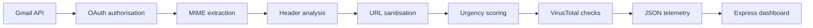

# Email Threat Scanner

Email Threat Scanner is a local security-analysis pipeline that retrieves recent Gmail messages with read-only OAuth access, extracts deterministic threat indicators, enriches up to three external URLs with VirusTotal intelligence, and sends structured JSON telemetry to a real-time Express dashboard.

The scanner supports analyst review; it does not declare that an email is malicious. Authentication failures, social-engineering language, and threat-intelligence detections are signals that require context and human judgement.

## Architecture



The Python process completes the analysis loop before `src/main.py` sends one final multi-message payload to `POST /api/reports` with `requests.post()`. The Node.js service validates and stores the payload in bounded memory, while the browser polls for near-real-time updates.

## Component responsibilities

- `src/main.py` manages Gmail read-only authorisation, message retrieval, scan orchestration, JSON output, and final dashboard delivery.
- `src/analyse.py` decodes nested MIME content, parses authentication headers, extracts and sanitises URLs, and scores social-engineering pressure.
- `src/virustotal.py` performs quota-aware VirusTotal API v3 URL lookups with bounded timeouts and no automatic retries.
- `src/reporting.py` creates the stable, content-minimised telemetry schema and overall risk classification.
- `dashboard/server.js` validates and stores recent payloads, serves the API and interface, restricts cross-origin requests, and handles graceful shutdown.
- `dashboard/public/` safely renders email-derived values with DOM text nodes to prevent script injection.
- `tests/` and `dashboard/test/` contain the Python and Node.js verification suites.

## Directory structure

```text
EmailThreatScanner/
├── dashboard/
│   ├── public/
│   │   ├── app.js
│   │   ├── index.html
│   │   └── styles.css
│   ├── test/
│   │   └── server.test.js
│   ├── package-lock.json
│   ├── package.json
│   └── server.js
├── src/
│   ├── __init__.py
│   ├── analyse.py
│   ├── main.py
│   ├── reporting.py
│   └── virustotal.py
├── tests/
├── .gitignore
├── credentials.json        # local and ignored
├── token.json              # generated locally and ignored
└── requirements.txt
```

## Prerequisites

- Python 3.12
- Node.js 20 or newer and npm
- A Google Cloud project with OAuth 2.0 desktop credentials
- A VirusTotal API key
- A Gmail account authorised for read-only access

## Python environment

Create and activate a virtual environment from the repository root:

```powershell
py -3.12 -m venv venv
.\venv\Scripts\activate
python -m pip install --upgrade pip
python -m pip install -r requirements.txt
```

The pinned dependencies include the Google API clients, `requests`, and `python-dotenv`. Install them only inside the virtual environment.

## Environment configuration

Create a local `.env` file in the repository root and set `VT_API_KEY` to your VirusTotal API key. The scanner loads this file automatically with `python-dotenv`.

Optional scanner variables can be set in the shell or added locally to `.env`:

| Variable | Default | Behaviour |
| --- | --- | --- |
| `GMAIL_MAX_MESSAGES` | `5` | Number of recent inbox messages, bounded from 1 to 100 |
| `VT_MAX_URLS` | `3` | VirusTotal lookups per execution, clamped from 0 to 3 |
| `VT_THROTTLE_SECONDS` | `16` | Delay between lookups, never allowed below 16 seconds |
| `DASHBOARD_REPORT_URL` | `http://127.0.0.1:3000/api/reports` | Express ingestion endpoint |

Dashboard process variables are supplied when starting Node.js:

| Variable | Default | Behaviour |
| --- | --- | --- |
| `DASHBOARD_HOST` | `127.0.0.1` | Local interface on which Express listens |
| `DASHBOARD_PORT` | `3000` | Listening port |
| `REPORT_HISTORY_LIMIT` | `25` | In-memory payload history, clamped from 1 to 100 |
| `DASHBOARD_ALLOWED_ORIGIN` | unset | Optional additional browser origin permitted by CORS |

Never put real keys in source files, screenshots, logs, or Git history.

## Gmail OAuth setup

1. Create or select a Google Cloud project.
2. Enable the Gmail API.
3. Configure the OAuth consent screen for the intended test or production users.
4. Create an OAuth client with the **Desktop app** application type.
5. Download the client file to the repository root as `credentials.json`.
6. Start the scanner and complete the browser authorisation flow.

The application requests only:

```text
https://www.googleapis.com/auth/gmail.readonly
```

This scope allows message retrieval but does not permit sending, modifying, labelling, or deleting mail. The first successful authorisation creates `token.json`; later runs load or refresh that token locally.

## Run the dashboard

Install its dependencies once, then start Express:

```powershell
Set-Location dashboard
npm install
npm start
```

Open `http://127.0.0.1:3000`. The dashboard begins in an empty state and polls `GET /api/reports` every three seconds. Report storage is intentionally in memory, so restarting Node.js clears the history. Replace `createReportStore()` in `dashboard/server.js` when durable database storage is required.

## Run the scanner

Start the dashboard first. In a second terminal at the repository root:

```powershell
.\venv\Scripts\activate
python -m src.main
```

The scanner retrieves recent inbox messages, prints content-minimised UTF-8 JSON, and then sends that same complete payload to the dashboard once. It never includes full message bodies, OAuth tokens, API keys, or Gmail credentials in telemetry.

## Dashboard API

### `POST /api/reports`

Accepts one scan envelope as JSON. The request body is limited to 256 KB and must match the expected schema. A valid payload returns `202 Accepted`; malformed JSON returns `400`, oversized requests return `413`, and schema violations return `422` with bounded validation details.

### `GET /api/reports`

Returns recent scan envelopes, newest first:

```json
{
  "count": 1,
  "reports": []
}
```

### `GET /api/health`

Returns service health and the number of stored scan envelopes:

```json
{
  "status": "ok",
  "stored_report_count": 1
}
```

## JSON report schema

Every scan envelope has these top-level fields:

| Field | Type | Meaning |
| --- | --- | --- |
| `schema_version` | string | Telemetry contract version |
| `scanner_version` | string | Producing scanner version |
| `scan_started_at` | UTC timestamp string | Scan start time |
| `scan_completed_at` | UTC timestamp string | Scan completion time |
| `message_count` | integer | Number of entries in `reports` |
| `reports` | array | Deterministically ordered email reports |

Each email report contains identifiers and timestamps, sender metadata, SPF/DKIM/DMARC statuses, spoofing flags, URL counts and records, social-engineering signals, VirusTotal verdicts and errors, overall risk, and scan status. Empty or unavailable values remain explicit rather than being treated as harmless.

Example payload:

```json
{
  "schema_version": "1.0",
  "scanner_version": "1.0.0",
  "scan_started_at": "2026-09-13T09:00:00Z",
  "scan_completed_at": "2026-09-13T09:00:17Z",
  "message_count": 1,
  "reports": [
    {
      "message_id": "18f0example",
      "thread_id": "18f0thread",
      "received_at": "2026-09-13T08:58:00Z",
      "subject": "Urgent action required",
      "sender": "Accounts <notice@example.com>",
      "reply_to": "support@example.net",
      "authentication": {
        "spf": "fail",
        "dkim": "pass",
        "dmarc": "fail"
      },
      "spoofing_flags": [
        "DMARC result is fail",
        "Reply-To mismatch detected: From 'Accounts <notice@example.com>' vs Reply-To 'support@example.net'",
        "SPF result is fail"
      ],
      "url_analysis": {
        "extracted_count": 2,
        "sanitised_count": 1,
        "sanitised_urls": ["https://example.net/verify?case=42"],
        "url_records": [
          {
            "original_url": "HTTPS://EXAMPLE.NET/verify?case=42#login",
            "sanitised_url": "https://example.net/verify?case=42"
          }
        ]
      },
      "social_engineering": {
        "score": 52,
        "severity": "high",
        "matched_indicators": [
          {
            "indicator": "urgent_action",
            "phrase": "urgent action required",
            "location": "subject",
            "points": 27
          },
          {
            "indicator": "identity_verification",
            "phrase": "verify your identity",
            "location": "body",
            "points": 25
          }
        ],
        "explanations": [
          "Demands urgent action.",
          "Requests identity or credential verification."
        ]
      },
      "virus_total": {
        "verdicts": [
          {
            "sanitised_url": "https://example.net/verify?case=42",
            "url_id": "aHR0cHM6Ly9leGFtcGxlLm5ldC92ZXJpZnk_Y2FzZT00Mg",
            "http_status": 200,
            "lookup_status": "complete",
            "malicious_count": 2,
            "suspicious_count": 1,
            "harmless_count": 70,
            "undetected_count": 5,
            "last_analysis_date": "2026-09-13T08:30:00Z",
            "error": null
          }
        ],
        "lookup_errors": []
      },
      "overall_risk": {
        "score": 100,
        "classification": "high"
      },
      "scan_status": "complete",
      "analysis_errors": []
    }
  ]
}
```

## VirusTotal quota behaviour

The client is deliberately conservative for the public API quota:

- It performs no more than three URL requests during one scanner execution, even when several emails contain links.
- The first request can run immediately; each later request starts at least 16 seconds after the previous request.
- `VT_MAX_URLS` can lower the execution limit but cannot raise it above three.
- `VT_THROTTLE_SECONDS` can increase the interval but cannot reduce it below 16 seconds.
- There are no automatic retries.
- HTTP `429`, authentication failures, timeouts, unknown URLs, and malformed responses produce explicit partial verdicts.
- Missing or unavailable VirusTotal data is never labelled harmless.

## Security guidance

- Keep `.env`, `credentials.json`, and `token.json` local. All are excluded by `.gitignore`.
- Revoke and replace a credential immediately if it enters Git history or appears in a log.
- Retain the Gmail read-only scope; do not add send, modify, or delete permissions.
- Keep the default dashboard host on `127.0.0.1` unless network access is intentionally secured.
- Set `DASHBOARD_ALLOWED_ORIGIN` only when a known cross-origin interface needs access.
- Treat subjects, senders, headers, and URLs as untrusted input. The dashboard renders them through `textContent`, never as HTML.
- Sanitisation performs no DNS resolution, redirect following, or network requests.
- Review operational logs before forwarding them, even though the application omits message content and secrets by design.

## Testing

Run the Python suite from the repository root:

```powershell
.\venv\Scripts\activate
python -m unittest discover -s tests -v
```

Run the dashboard suite:

```powershell
Set-Location dashboard
npm test
```

The tests cover MIME traversal, malformed bodies, URL de-noising, internationalised hostnames, social-engineering scoring, quota enforcement, VirusTotal failures, Unicode telemetry, partial Gmail payloads, final dashboard delivery, API schema validation, and bounded in-memory history.

## Limitations and false positives

- Rule-based language scoring cannot understand every business context, culture, language, or legitimate urgent request.
- SPF, DKIM, or DMARC failures may arise from forwarding, mailing lists, or sender configuration problems.
- A VirusTotal result reflects available historical analysis and may be absent, delayed, or disagree across engines.
- Static asset filtering is intentionally maintainable and conservative; unfamiliar tracking or redirect links can remain.
- The scanner does not follow redirects, detonate attachments, inspect QR codes, resolve domains, or execute content.
- Multipart alternatives can contain duplicate visible content, although phrase categories are capped to prevent repeated text from inflating the score without limit.
- Dashboard history is process-local and is lost at shutdown.

An overall risk classification is a prioritisation aid, not proof of malicious intent. Analysts should inspect message context, organisational policy, and independent evidence before taking action.

## Future enhancements

- Durable encrypted report storage with retention controls
- Attachment hashing and sandbox integration
- Domain age, DNS, certificate, and redirect-chain intelligence
- QR-code and image-link extraction
- Organisation-specific allowlists and scoring policies
- Server-Sent Events for push updates instead of polling
- Authentication and role-based dashboard access
- Exportable incident records and case-management integration
- Internationalised phrase packs with calibrated thresholds
